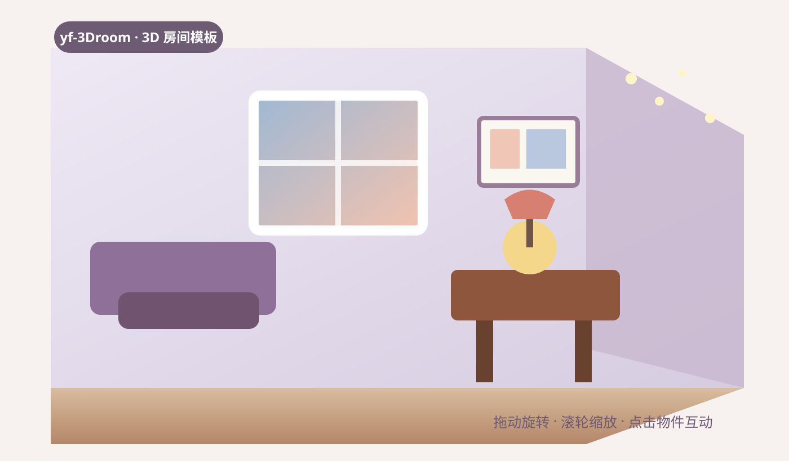

# yf-3Droom

一个可以直接复用的 Three.js 3D 房间模板。打开网页后，用户可以在房间里旋转、缩放，并点击家具和小物件，查看照片、播放音乐、切换窗外天气、生成随机小票等生活化互动。

本仓库是独立的 3D 房间项目，不包含个人简历页面，也不包含真实个人照片。照片墙和茶几美食使用了可替换的占位图，下载后可以换成你自己的素材。



## 预览

- 在线仓库：[github.com/YYFan-SZ/yf-3Droom](https://github.com/YYFan-SZ/yf-3Droom)
- 本地开发地址：<http://localhost:5173/>

如果项目部署到 GitHub Pages、Vercel 或其他静态托管平台，把部署后的网址替换到这里即可。

## 功能简介

- 3D 房间场景：支持拖动旋转、滚轮缩放，首次打开会预加载主要房间资源。
- 照片墙：点击后打开相册，可以上一张、下一张；当前默认是占位图。
- 茶几甜点：点击食物进入美食相册，同样支持前后翻看。
- 黑胶唱片机：打开音乐播放器，可播放、暂停和切换示例曲目。
- 窗户和窗帘：点击后循环切换白天阳光、黄昏、夜晚星空、雨天玻璃。
- 小票机：第一次点击靠近小票机，第二次点击打印随机文案；支持“保存小票”和“再来一张”。
- 联系邮箱、卡套等物件：打开对应的信息或近距离查看面板。
- 右上角返回全景按钮：始终显示，拖动或滚轮改变视角后可一键回到初始视角。
- 探索进度：发现全部互动后，星星灯闪烁并显示“已解锁所有隐藏惊喜！”。

## 操作流程

1. 安装依赖并启动项目，等待房间资源加载完成。
2. 在空白处拖动鼠标旋转房间，滚轮缩放视角。
3. 点击物件进行探索：唱片机、照片墙、茶几食物、联系邮箱、小票机、卡套、窗户/窗帘。
4. 小票机需要点击两次：第一次靠近，第二次让纸张从机器中弹出。
5. 如果视角被改变，点击右上角圆形按钮返回全景。
6. 发现全部 8 个互动后，观察房间里的星星灯和解锁提示。

## 本地运行

需要 Node.js 18 或更高版本。

```bash
npm install
npm run dev
```

然后打开终端显示的地址，通常是 <http://localhost:5173/>。

构建生产版本：

```bash
npm run build
npm run preview
```

## 替换成自己的内容

### 照片墙

1. 将图片放入 `public/photos/`。
2. 打开 `src/main.js`，找到 `PHOTO_WALL_ITEMS`。
3. 把占位图路径改成自己的文件名，例如 `/photos/my-photo.jpg`，并修改后面的标题。
4. 如果使用缩略图预加载，再把缩略图放入 `public/photos/thumbs/`。

### 茶几美食

1. 将食物图片放入 `public/food-gallery/`。
2. 在 `src/main.js` 的 `FOOD_GALLERY_ITEMS` 中替换图片路径和标题。

### 模型与音乐

- 3D 模型放在 `public/models/`，对应路径在 `src/main.js` 中。
- 音频放在 `public/music/`，对应曲目在 `MUSIC_TRACKS` 中。
- 仓库里的示例音乐和 3D 模型可能有各自的授权要求。公开发布或商业使用前，请确认素材来源和授权范围；最稳妥的方式是替换成你拥有版权或明确取得许可的资源。

## 目录结构

```text
public/
  models/          3D 模型
  music/           示例音乐
  photos/          照片墙（默认占位图）
  food-gallery/    美食相册（默认占位图）
src/
  main.js          场景、资源预加载和互动逻辑
  style.css        页面和弹窗样式
docs/
  preview.svg      README 预览示意图
```

## 许可证

项目代码采用 [MIT License](LICENSE)。它允许你学习、修改、发布和制作自己的版本，但第三方模型、音乐和你后来加入的照片不自动包含在这个代码许可证里，请分别确认它们的使用权。

